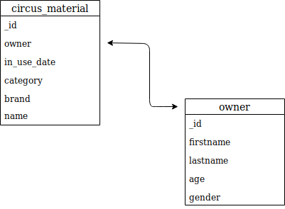

# ProjectCloudAPI

## Foursquare API

API for building location-aware experience apps or websites.
I used the regular API-endpoints for this project.

## Circus-material API

REST API where you can see features of cirus-material.

### GET
- show material
- show owners
- show categories
- show in_use date
### POST
- add material
- add owner
- add category
### PUT
- change material
- change owner

## Entity relation model

